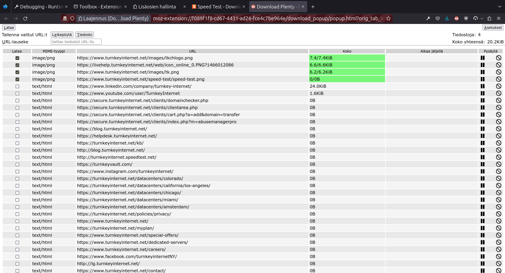

# Description

Download manager addon for Firefox and Chrome.

# Usage

Files are downloaded by selecting them on an individual basis, using a regular
expression to match the URLs or by pressing the MIME type, which selects (or
deselects) all the files having the same MIME type. And then pressing the
download button.

You can sort the files by clicking on the column headers.

The URLs of the selected files can be saved into a file or to the clipboard.

You can limit the files shown by selecting MIME types in the options page.

# Limitations

The addon doesn't work if fetch is not allowed in NoScript.

# Screenshots

# Install

[Download Plenty in AMO](https://addons.mozilla.org/addon/download-plenty/)

[Download Plenty in Chrome Web Store](https://chromewebstore.google.com/detail/download-plenty/ioliclooohbljgnblhlfbfahijakonpb)

# Licenses

GPL3.

## Other Resources

data/logo*svg files by [Elegant Themes](https://www.elegantthemes.com/), licensed as GPL2
(see https://www.elegantthemes.com/blog/freebie-of-the-week/beautiful-flat-icons-for-free).

DOMPurify.js by Mario Heiderich, licensed as Apache License Version 2.0 or Mozilla Public
License Version 2.0. https://github.com/cure53/DOMPurify

webL10n by Fabien Cazenave, Mozilla, licensed as BSD/MIT/WTFPL.
https://github.com/fabi1cazenave/webL10n
